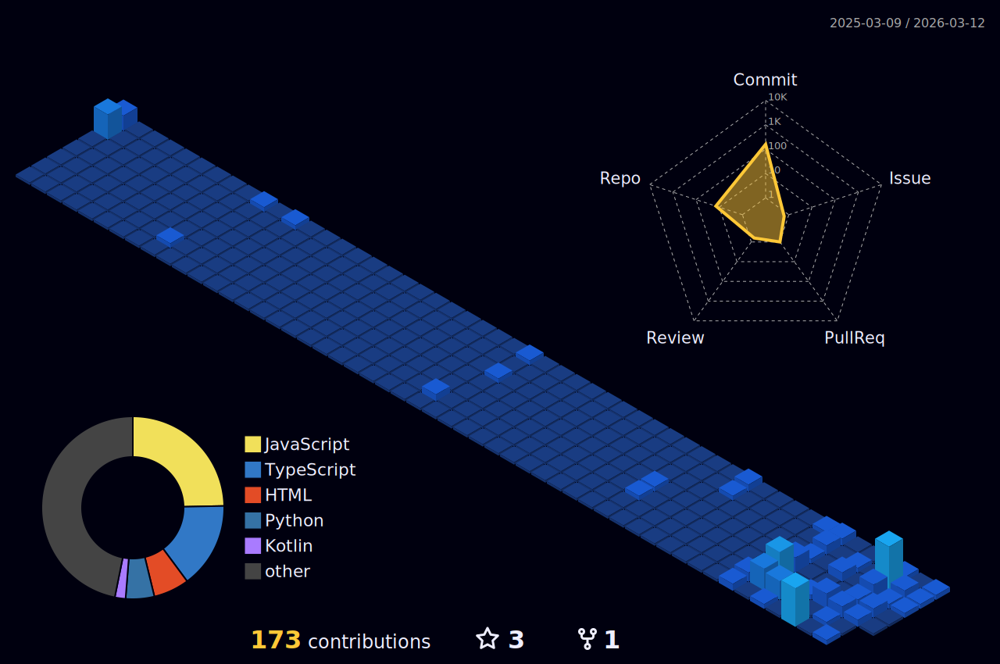

<div align="center">
  
</div>

<table border="0" width="100%">
  <tr>
    <td width="60%" valign="top">
      <h3>👨‍💻 const aboutMe = ...</h3>
      <sub>

```javascript
const coder = {
  name: "Koby Christian",
  education: "BS Computer Science",
  location: "Philippines",
  
  // 🚀 Active Projects
  working_on: {
    mobile: ["Trackbing (Fitness)", "Lakbay (Travel)"],
    web: ["Chiekoi Store (E-commerce)"]
  },

  // 💻 Tech Stack
  technologies: {
    languages: ["JS", "Python", "Rust", "Go"],
    frontend: ["React", "Tailwind", "Flutter"],
    backend: ["Node", "Django", "Supabase"]
  },

  // ⚡ Interests
  interests: ["Automation", "Machine Learning"]
};
```

  </sub>
    </td>
    <td width="40%" valign="center" align="center">
      <br><br>
      <p align="center"><b>My GitHub Activity</b></p>
      
    </td>
  </tr>
</table>

💻 Languages and Tools:

<p align="left"> <a href="https://skillicons.dev">  </a> </p>

<br>

<h2 align="center">💻 Top Languages</h2>

<p align="center">
  
</p>
