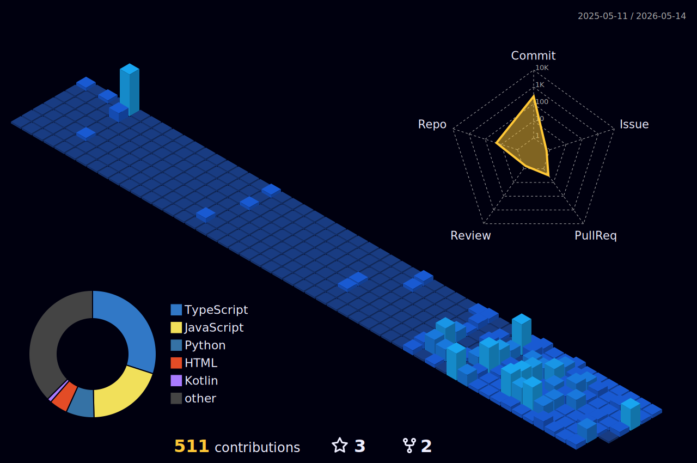

<div align="center">
  
</div>

<table border="0" width="100%">
  <tr>
    <td width="60%" valign="top">
      <h3  align="center">👨‍💻 const aboutMe = ...</h3>
      <sub>

```javascript
const coder = {
  name: "Koby Christian O. Atilano",
  education: "BS Computer Science",
  location: "Tagoloan, Philippines",
  
  //  Recent Projects
  working_on: {
    mobile: ["Trackbing (Calorie-Tracker)", "Lakbay (Travel-Planner)"],
    web: ["Chiekoi Store,BingCatcher, MisorTransit"]
  },

  //  Tech Stack
  technologies: {
    languages: ["JS", "Python", "C++", "C#", "C"],
    frontend: ["React", "Tailwind", "Flutter", "CSS"],
    backend: ["Node", "Django", "Supabase"]
  },

  //  Interests
  interests: ["Automation", "Machine Learning, AI, beside you by keshi"]
};
```

  </sub>
    </td>
    <td width="40%" valign="center" align="center">
      <br><br>
      <p align="center"><b>My GitHub Activity</b></p>
      
    </td>
  </tr>
</table>

💻 Languages and Tools:

<p align="left"> <a href="https://skillicons.dev">  </a> </p>
